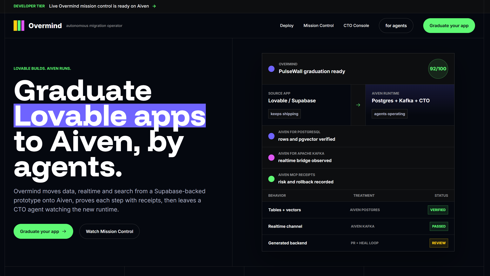
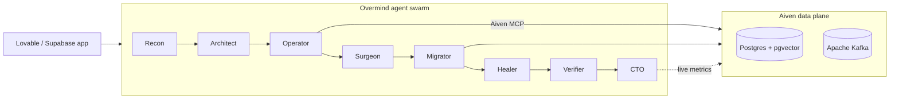

<div align="center">

# Overmind

### The agentic front door to Aiven.

**Point Overmind at a Lovable/Supabase app — an agent swarm graduates its data, realtime and search onto Aiven, then an always-on CTO agent runs it for you.**

[**Live demo**](https://toukkelipoukkeli-glitch.github.io/overmind-live/) · [**▶ Watch the demo**](docs/media/demo.mp4) · [**Quickstart**](#quickstart)


<a href="https://toukkelipoukkeli-glitch.github.io/overmind-live/">
  
</a>

</div>

---

## Demo

<video src="https://github.com/toukkelipoukkeli-glitch/sunstead/raw/main/overmind/docs/media/demo.mp4" controls muted playsinline width="100%"></video>

> ▶︎ **[Watch the 50-second demo](docs/media/demo.mp4)** (if the player above doesn't load) — an agent crew migrates a Lovable/Supabase app onto Aiven: connect → migrate the database → open the PR.

---

## What it is

You build fast on a starter stack — then you outgrow it. The app scales, the bill climbs, and you
suddenly need **proper, production-grade infrastructure**: managed Postgres, real streaming, scaling,
pooling, replicas. But the starter backend locks you in, hides your credentials, and getting your
data out without losing a row is the kind of job you're not supposed to have to do.

**Overmind is the exit ramp.** It doesn't just copy tables — it does **behavior migration**: it
recovers what your app expected its backend to *do* (auth, storage, realtime, data API, vector
search) and re-expresses each behavior on an Aiven-native primitive. It moves your data with verified
row-count parity, generates the replacement backend, opens a pull request, and then **stays on as an
always-on CTO agent** reading live Aiven metrics. Your data and realtime go live on Aiven; the app
keeps shipping; your CTO operates it.

> **Behavior migration, not just data migration.** Data migration asks *"can I copy these tables?"*
> Overmind asks *"what did this app expect its backend to **do** — and which of those become
> Aiven-native?"*

---

## How it works

One click runs a swarm of specialist agents through a 10-phase pipeline. Every infrastructure action
is an autonomous tool call recorded as an auditable **receipt** and streamed live to Mission Control.



| Phase | What happens |
|---|---|
| **recon** | Clone the repo, scan the code, and introspect the live source database. |
| **graph** | Classify every backend behavior into a **behavior graph** with a 0–100 readiness score. |
| **plan** | Design the target Aiven stack (Postgres + pgvector, Kafka) and estimate cost. |
| **provision** | Create a fresh Aiven Postgres and Kafka **live through the Aiven MCP**. |
| **migrate** | Move schema, rows and embeddings into Aiven Postgres. |
| **generate** | Write the Aiven-native backend — JWT auth, data API, a Kafka→SSE realtime bridge, vector search. |
| **heal** | Test the generated code, read the real errors, patch, and repeat until green. |
| **verify** | Assert row-count parity, run a Kafka produce→consume roundtrip and a pgvector search. |
| **cutover** | Open a GitHub pull request repointing the app at its new Aiven backend. |
| **operate** | The CTO agent reads live Aiven metrics and recommends the next move — scale, index, region. |

**The swarm** — Recon (reads the app) · Architect (graph → Aiven stack + cost) · Operator (drives the
Aiven MCP) · Surgeon (generates the backend) · Migrator (moves data + embeddings) · Healer
(generate → test → patch loop) · Verifier (parity, Kafka, vector search) · CTO (stays on, reads live
metrics). Each agent is a bounded tool-loop — autonomy you can audit, not a free-form shell.

> Every external dependency is optional. Missing a key drops that stage to a deterministic path, so
> the full pipeline runs end to end out of the box — add credentials to make it live.

---

## MCP, two ways

Overmind treats the **[Model Context Protocol](https://modelcontextprotocol.io)** as the data layer,
both as a client and as a server.

**It drives the Aiven MCP.** A Claude (Opus 4.8) agent connects to the live Aiven MCP via the
Messages API MCP connector and calls the tools itself — provisioning services, creating topics,
reading connection info, writing and reading rows, fetching metrics. The MCP isn't a cosmetic call:
*its output is the connection string the migrated app actually runs on.*

```
aiven_service_create · aiven_service_get · aiven_service_type_plans · aiven_service_plan_pricing
aiven_service_connection_info · aiven_pg_write · aiven_pg_read · aiven_pg_optimize_query
aiven_pg_service_available_extensions · aiven_kafka_topic_create · aiven_kafka_topic_message_produce
aiven_kafka_topic_message_list · aiven_service_metrics_fetch
```

**It is itself an MCP server.** Overmind exposes its own operations as MCP tools (stdio,
[`@modelcontextprotocol/sdk`](https://github.com/modelcontextprotocol)), so any agent in any MCP
client can drive a full migration:

| Tool | Does |
|---|---|
| `overmind_analyze` | Scan an app → behavior graph + readiness score (read-only). |
| `overmind_migrate` | Run a full migration onto Aiven. |
| `overmind_status` | Live infra health, in plain English. |
| `overmind_advise` | The CTO's next-move recommendations. |
| `overmind_cost` | Aiven cost vs. the source backend. |
| `overmind_services` | List the tenant's Aiven services. |

See [`mcp/README.md`](mcp/README.md) for the server.

---

## Quickstart

Prereqs: **Node 20+**.

```bash
npm install
cp .env.example .env.local      # every key is optional — it runs without any
npm run dev                     # API on :8788, web on :5180 (Vite proxies /api → :8788)
```

Open **http://localhost:5180**, then hit **Launch** in Mission Control.

With no keys, the full pipeline runs end to end on deterministic paths — great for a first look. Add
`AIVEN_TOKEN` and `ANTHROPIC_API_KEY` to make provisioning and migration live against real Aiven
services.

Headless run (stream every event as JSON lines on stdout):

```bash
npm run migrate:demo
```

---

## Configuration

All variables are optional and degrade gracefully — see [`.env.example`](.env.example) for the full list.

| Variable | Unlocks |
|---|---|
| `AIVEN_TOKEN` / `AIVEN_PROJECT` | The live Aiven MCP + REST surface (provisioning, Postgres, Kafka, metrics). |
| `ANTHROPIC_API_KEY` | The agent swarm and the Aiven-MCP agent. Unset → deterministic narration. |
| `SOURCE_DATABASE_URL` | Migrate **your own** Supabase/Postgres app (DB-to-DB copy). Never logged. |
| `KAFKA_BROKERS` / `KAFKA_USERNAME` / `KAFKA_PASSWORD` | The realtime Kafka path (produce/consume). |
| `ELEVENLABS_API_KEY` | The Voice CTO — spoken status + weekly briefing. |
| `WORKOS_*` | Human + agent auth. Absent → self-contained mock mode (locally-signed scoped JWTs). |

---

## API

The server is [Hono](https://hono.dev) on `0.0.0.0:8788`.

- `GET /api/health` — readiness + which integrations are live.
- `GET /api/stream` — SSE of typed `SwarmEvent`s. The UI is a pure function of this stream.
- `POST /api/run` — start a migration (auth-gated: human session **or** registered agent).
- `POST /api/agents/register` — an agent self-registers for scoped, short-lived credentials.

<details>
<summary>CTO console endpoints</summary>

- `GET /api/cto/state` — live Postgres/Kafka health, rows, connections, cost, alerts.
- `POST /api/cto/chat` — SSE: ask the CTO a question, answered from live metrics.
- `POST /api/cto/speak` — ElevenLabs TTS (server-side only).
- `GET /api/cto/briefing` — a spoken weekly briefing grounded in real metrics.

</details>

---

## Project layout

A single npm package, no workspaces.

```
core/      deterministic migration brain — repo scan + DB introspection → behavior graph
aiven/     all Aiven access — the Aiven MCP agent, REST fallback, Postgres + Kafka clients
surgeon/   codegen — emits the Aiven-native backend (auth, data API, realtime bridge, search)
agents/    the Anthropic Agent SDK swarm — Recon · Architect · Surgeon · Healer · CTO
server/    orchestrator + 10-phase state machine, SSE fan-out, self-heal loop, verifier, auth
web/       Mission Control — a React dashboard that renders the /api/stream SSE live
mcp/       the Overmind MCP server — overmind_* tools over stdio
```

The contract for the whole system is one file — [`shared/types.ts`](shared/types.ts) — imported by
every package and the UI.

---

## Tech stack

**TypeScript** · **Hono** + SSE · **React** + **Vite** · **Anthropic Claude (Opus 4.8)** ·
**Aiven for PostgreSQL** (+ pgvector) · **Aiven for Apache Kafka** ·
**MCP** (`@modelcontextprotocol/sdk`) · `pg` · `kafkajs` · WorkOS + `jose` · ElevenLabs.

---

<div align="center">

**Stop managing infra. Start talking to it.**

</div>
