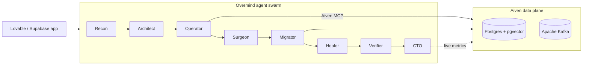

<div align="center">

# Overmind

### The agentic front door to Aiven.

**Overmind migrates your data and behavior off locked-in vendors like Lovable onto proper, cheaper Aiven infra — by an agent swarm via the MCP — then an always-on CTO agent runs it for you.**

[**Live demo**](https://toukkelipoukkeli-glitch.github.io/overmind-live/) · [**▶ Watch the demo**](docs/media/demo.mp4) · [**Quickstart**](#quickstart)


<a href="https://toukkelipoukkeli-glitch.github.io/overmind-live/">
  
</a>

</div>

---

## Demo

<video src="https://github.com/toukkelipoukkeli-glitch/sunstead/raw/main/overmind/docs/media/demo.mp4" controls muted playsinline width="100%"></video>

> ▶︎ **[Watch the 50-second demo](docs/media/demo.mp4)** (if the player above doesn't load) — an agent crew migrates a Lovable/Supabase app onto Aiven: connect → migrate the database → open the PR.

---

**Overmind is the agentic front door to Aiven.** Point it at a Lovable/Supabase app and a swarm of autonomous Claude agents *graduates the heavy backend layer — data, realtime, vector search — onto Aiven while you watch.* Then an always-on **CTO agent** stays on and operates it. You never open a dashboard.

### The moment we built for
You vibe-code a hit on Lovable, ship it on Supabase, and never think about infra — that is the whole point. Then it scales, you need real database infrastructure, and the bill climbs with you. But the starter stack **locks you in**: Lovable hides your DB credentials, the costs are high, and getting your data out — without losing a row — is painful, expensive, and terrifying. You are not an infra engineer — but you now need **proper, production-grade infrastructure**: managed Postgres, real streaming, scaling, pooling, replicas. **Lovable builds the app; Aiven should run it the moment it becomes a company.** Overmind is that exit ramp, automated.

### Behavior migration, not just data migration
Data migration asks *"can I copy these tables?"* Overmind asks *"what did this app expect its backend to **do** — auth, storage, realtime, data API, vector search — and which of those become Aiven-native?"* One click runs a 10-phase swarm: **recon → graph → plan → provision → migrate → generate → heal → verify → cutover → operate.**

- **Recon** scans the repo *and* introspects the live database into a **behavior graph** with evidence (file:line / `pg_*` catalog) and a 0–100 readiness score.
- **Operator** drives the **live Aiven MCP** to provision a fresh Aiven Postgres (pgvector) + Kafka, create topics, and read connection info. Every `aiven_*` call becomes a **receipt** in an auditable ledger streamed live to mission control.
- **Migrator + Verifier** move schema, rows and embeddings, then prove it: **row-count parity** vs. the source, a smoke query, a real **Kafka produce→consume roundtrip**, and a **pgvector similarity search** on the new DB.
- **Surgeon + Healer** generate the Aiven-native replacement backend (JWT auth, data API, Kafka→SSE realtime bridge, vector search) and self-heal it in a generate → check → patch → re-check loop — then open a real **GitHub PR**. Where the sensible migrator *flags* auth/storage as "adapter required," Overmind *builds* them.
- **CTO** never leaves: it reads live `pg_stat` + Aiven metrics and answers *"what should I do next?"* — scale this, index that, the cheaper and greener region. You can talk to it.

### Built for "The Autonomous Data Operator"
- **MCP depth (34%):** a real Opus-4.8 agent autonomously *chains* the Aiven MCP — `aiven_service_create/_get/_type_plans/_plan_pricing/_connection_info`, `aiven_pg_write/_read/_service_available_extensions/_optimize_query`, `aiven_kafka_topic_create/_message_produce/_message_list`, `aiven_service_metrics_fetch`. MCP is not one decorative call — *its output is the connection string the migrated app runs on.* And **Overmind is itself an MCP server**: it exposes `overmind_analyze / _status / _advise / _cost / _services / _migrate`, so any agent can drive a full migration. MCP all the way down.
- **Workflow autonomy (33%):** one human input ("Graduate"). The swarm picks the plan, region and target stack itself, writes and repairs its own generated code, and **agents self-register for scoped JWTs** (WorkOS AuthKit) before they are allowed to run.
- **Creativity & impact (33%):** the **behavior graph** + the **operator layer** ("never open the dashboard") are a genuinely new way to consume Aiven. Every migration lands an Aiven account the moment a startup is scaling — onto **real, production-grade infrastructure**, not just a cheaper backend — and every CTO suggestion expands consumption: Aiven for Startups' land-and-expand, automated, with a **cost delta ($599/mo → Aiven)** and a carbon-aware region as bonus.

### What is real (no smoke)
Live on Aiven project `touko-1f1c`: the agent provisions services and creates topics via MCP; real schema, rows and embeddings move with verified parity; a nonce-matched Kafka roundtrip and pgvector search run against it; the CTO reads live metrics. Every external key is optional and degrades to a labelled deterministic path, so the pipeline always runs end to end. **Honest caveat:** the generated backend is generated and checked but not yet *deployed* — Aiven Apps is limited-availability. Real where it's real, honest where it isn't.

### Tech stack
TypeScript throughout. **Anthropic Claude (Opus 4.8)** drives the agent swarm; the **Aiven MCP** (via the Messages API MCP connector) is the control plane; **Aiven for PostgreSQL (+pgvector)** and **Aiven for Apache Kafka** are the data plane and agent bus. Hono + SSE API; a React/Vite mission control that is a pure function of the event stream; `pg`, `kafkajs`; WorkOS + `jose` for agentic auth; `@modelcontextprotocol/sdk` for the Overmind MCP; ElevenLabs for a Voice CTO briefing.

---

## Architecture

One click runs the swarm through a 10-phase pipeline; every infrastructure action is an autonomous tool call recorded as an auditable **receipt** and streamed live to Mission Control.



`recon → graph → plan → provision → migrate → generate → heal → verify → cutover → operate`

---

## Quickstart

Prereqs: **Node 20+**.

```bash
npm install
cp .env.example .env.local      # every key is optional — it runs without any
npm run dev                     # API on :8788, web on :5180 (Vite proxies /api → :8788)
```

Open **http://localhost:5180**, then hit **Launch** in Mission Control.

With no keys, the full pipeline runs end to end on deterministic paths — great for a first look. Add
`AIVEN_TOKEN` and `ANTHROPIC_API_KEY` to make provisioning and migration live against real Aiven
services.

Headless run (stream every event as JSON lines on stdout):

```bash
npm run migrate:demo
```

---

## Configuration

All variables are optional and degrade gracefully — see [`.env.example`](.env.example) for the full list.

| Variable | Unlocks |
|---|---|
| `AIVEN_TOKEN` / `AIVEN_PROJECT` | The live Aiven MCP + REST surface (provisioning, Postgres, Kafka, metrics). |
| `ANTHROPIC_API_KEY` | The agent swarm and the Aiven-MCP agent. Unset → deterministic narration. |
| `SOURCE_DATABASE_URL` | Migrate **your own** Supabase/Postgres app (DB-to-DB copy). Never logged. |
| `KAFKA_BROKERS` / `KAFKA_USERNAME` / `KAFKA_PASSWORD` | The realtime Kafka path (produce/consume). |
| `ELEVENLABS_API_KEY` | The Voice CTO — spoken status + weekly briefing. |
| `WORKOS_*` | Human + agent auth. Absent → self-contained mock mode (locally-signed scoped JWTs). |

---

## API

The server is [Hono](https://hono.dev) on `0.0.0.0:8788`.

- `GET /api/health` — readiness + which integrations are live.
- `GET /api/stream` — SSE of typed `SwarmEvent`s. The UI is a pure function of this stream.
- `POST /api/run` — start a migration (auth-gated: human session **or** registered agent).
- `POST /api/agents/register` — an agent self-registers for scoped, short-lived credentials.

<details>
<summary>CTO console endpoints</summary>

- `GET /api/cto/state` — live Postgres/Kafka health, rows, connections, cost, alerts.
- `POST /api/cto/chat` — SSE: ask the CTO a question, answered from live metrics.
- `POST /api/cto/speak` — ElevenLabs TTS (server-side only).
- `GET /api/cto/briefing` — a spoken weekly briefing grounded in real metrics.

</details>

---

## Project layout

A single npm package, no workspaces.

```
core/      deterministic migration brain — repo scan + DB introspection → behavior graph
aiven/     all Aiven access — the Aiven MCP agent, REST fallback, Postgres + Kafka clients
surgeon/   codegen — emits the Aiven-native backend (auth, data API, realtime bridge, search)
agents/    the Anthropic Agent SDK swarm — Recon · Architect · Surgeon · Healer · CTO
server/    orchestrator + 10-phase state machine, SSE fan-out, self-heal loop, verifier, auth
web/       Mission Control — a React dashboard that renders the /api/stream SSE live
mcp/       the Overmind MCP server — overmind_* tools over stdio
```

The contract for the whole system is one file — [`shared/types.ts`](shared/types.ts) — imported by
every package and the UI. Drive a migration from any MCP client via the Overmind MCP server — see
[`mcp/README.md`](mcp/README.md).

---

<div align="center">

**Stop managing infra. Start talking to it.**

</div>
